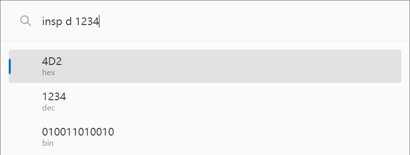
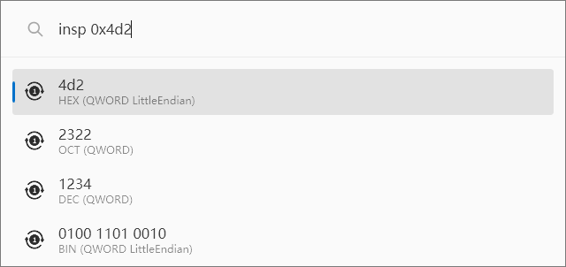

# PowerHexInspector

A simple [PowerToys Run](https://learn.microsoft.com/en-us/windows/powertoys/run) plugin.

Provides functionality to convert numbers to different bases.

[简体中文](./README_ZH-CN.md)

## Usage

### Trigger Keyword

The current trigger keyword is `insp`.

### Input Format

The input format is:

    insp {base} {input}

The base can be one of the following values:

- `b` or `B`: Binary
- `o` or `O`: Octal
- `d` or `D`: Decimal
- `h` or `H`: Hexadecimal
- `a` or `A`: ASCII

Or use

    insp {input}

In this case, the input should be a string that follows the rules below:

- A string starting with `0x` will be considered hexadecimal
- A string starting with `0b` will be considered binary
- A string starting with `0` will be considered octal
- A string surrounded by double quotes will be considered ASCII
- Otherwise, it will be considered decimal

### Example

Clicking or pressing `Enter` will copy the conversion result to the clipboard.

## Installation
Download the latest release, extract it, and place the `PowerHexInspector` folder into the `%LOCALAPPDATA%\Microsoft\PowerToys\PowerToys Run\Plugins` directory. Then, restart PowerToys.